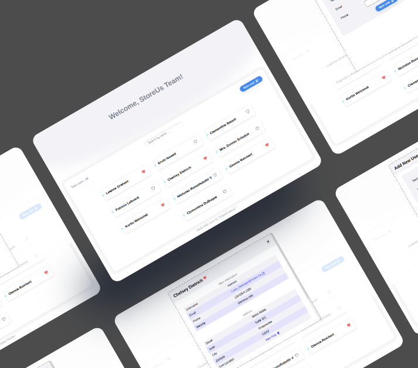

# StoreUs Task 1

[Live Demo](https://storeus-task-1.vercel.app/)



This project is a React application that interacts with the JSONPlaceholder API to manage a list of users. Users can view user details, mark favorites, and add new users through a form. It's designed to demonstrate React component integration with external APIs and state management for user interaction.

## Table of Contents

- [Features](#features)
- [Installation](#installation)
- [Usage](#usage)
- [Technologies Used](#technologies-used)

## Features

1. Display User List

- Create a React component called UserList.
- Fetch a list of users from the JSONPlaceholder API (https://jsonplaceholder.typicode.com/users).
- Display the names of users in a list format.

2. Show User Details

- Each user in the list is clickable.
- When a user is clicked, show detailed information about that user.
- Display the user's information in a modal or a separate section.

3. Mark/Unmark User as Favorite

- Add the ability to mark/unmark a user as a favorite.
- Store this information in the component's state.
- Update the UI to reflect the favorite status of users.

4. Add User Form

- Create a form component called AddUserForm.
- Include fields for the user's name, email, and phone number.
- Allow users to submit the form to add a new user.

5. Handle Form Submission

- Upon submitting the form, make a POST request to the JSONPlaceholder API to add the new user.
- Update the list of users to reflect the changes without a page refresh.

## Installation

1. Clone the repository:

   ```bash
   git clone https://github.com/khalednassar500/storeus-task-1.git
   ```

2. Navigate to the project directory:

   ```bash
   cd storeus-task-1
   ```

3. Install dependencies:

   ```bash
   npm install
   ```

## Usage

1. Start the development server:

   ```bash
   npm start
   ```

2. Open your browser and navigate to `http://localhost:3000` to view the app.

## Technologies Used

List the technologies and libraries/frameworks used in your project.

- React
- Redux Toolkit
- React-Redux
- Material-ui
- HTML/CSS
- Typescript
